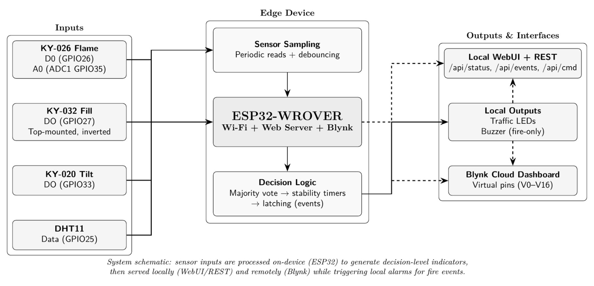
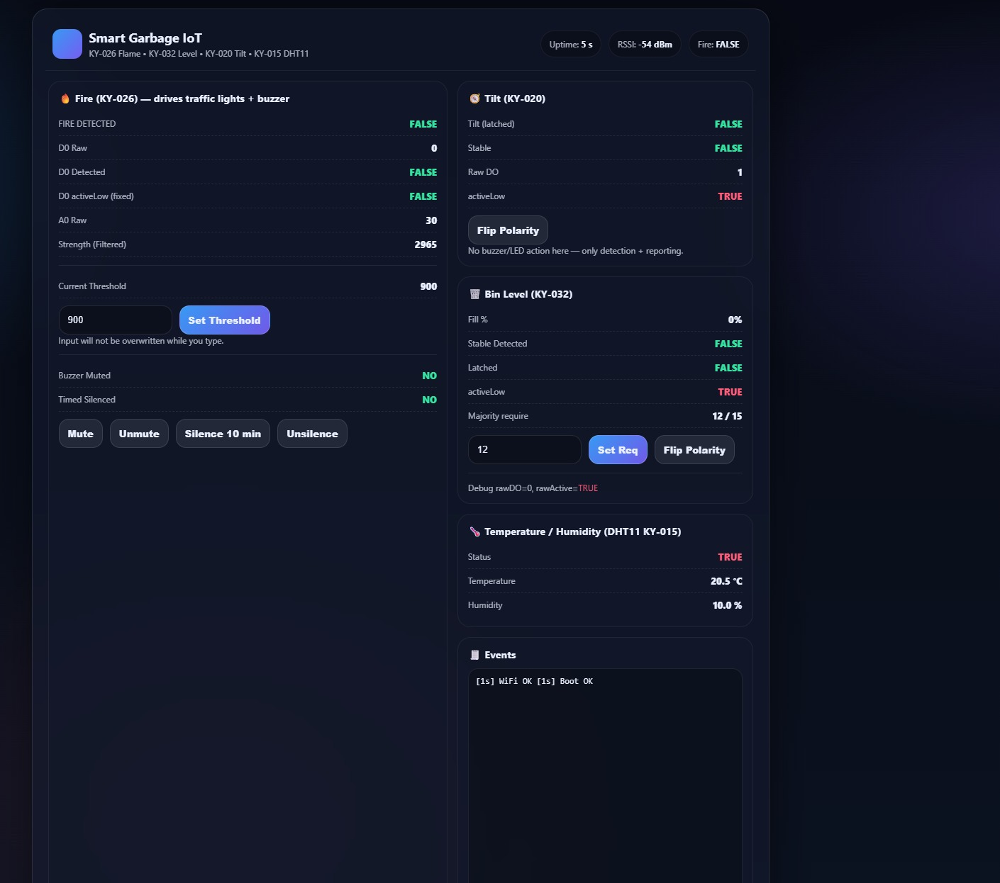
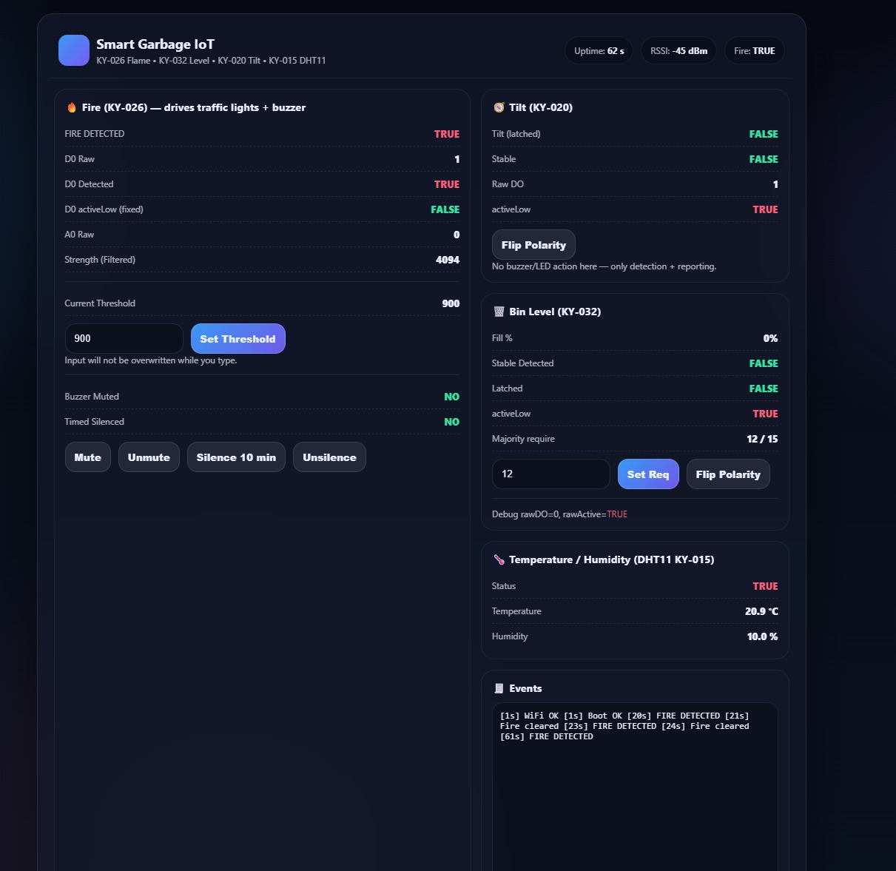
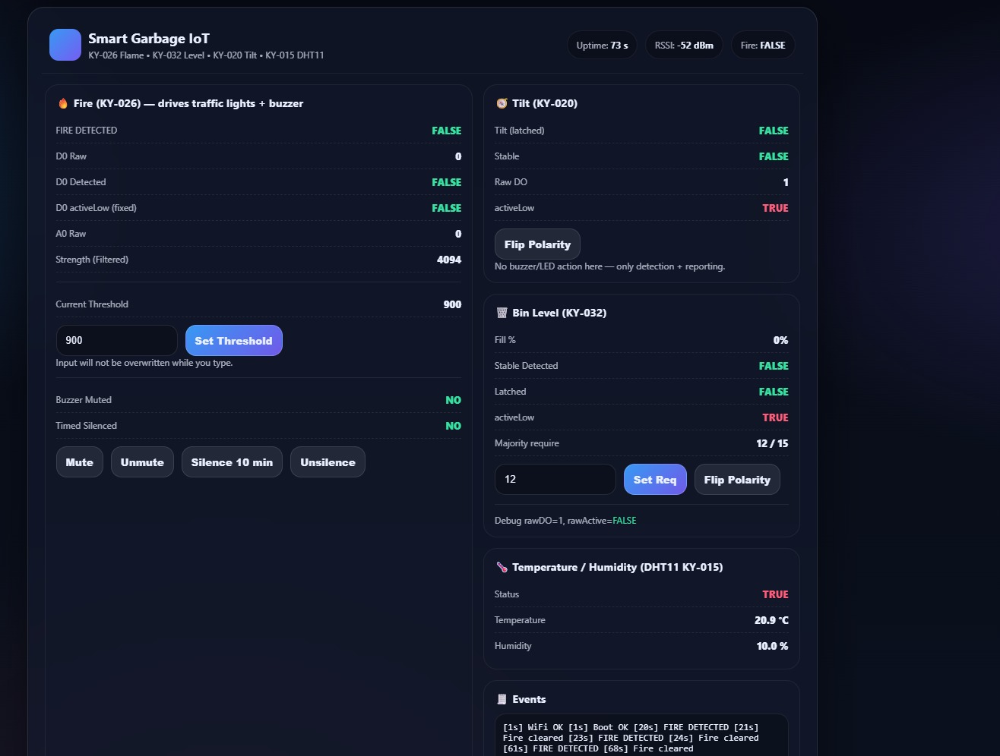
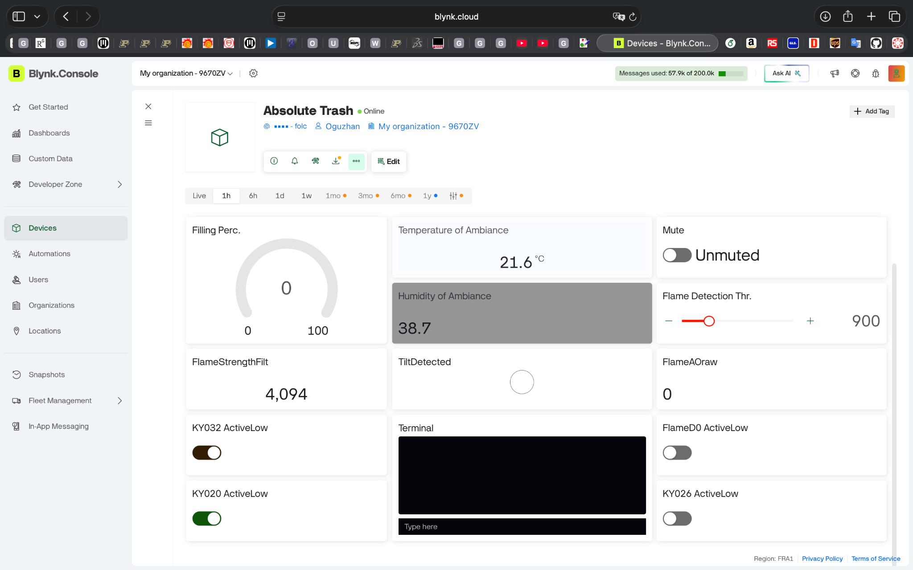
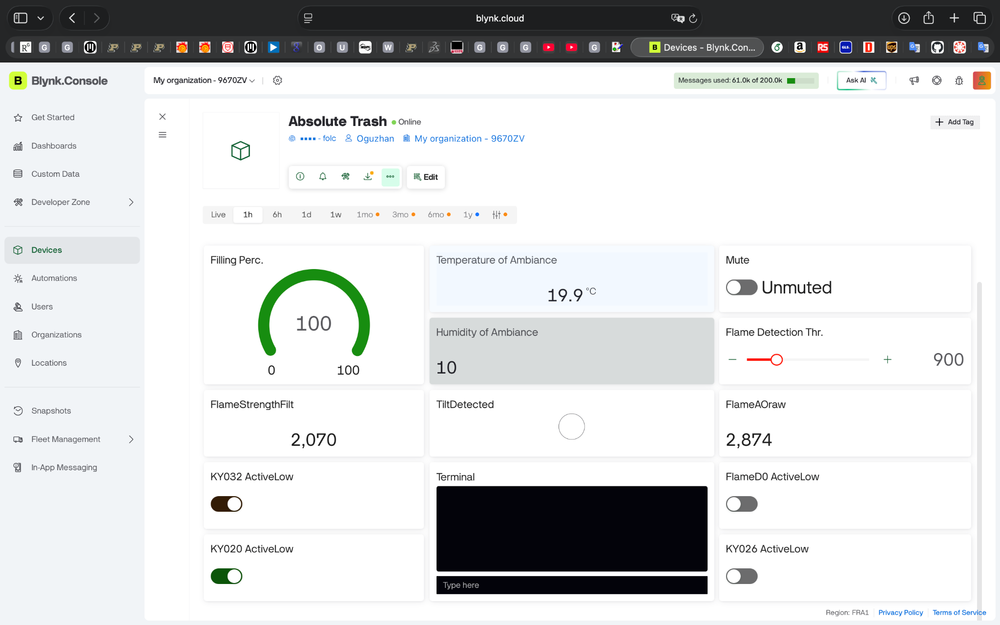

# Smart Garbage IoT (ESP32-WROVER + WebUI/REST + Blynk)

A practical IoT prototype for **smart waste-bin monitoring** in sustainable-city scenarios.
The device runs on an **ESP32-WROVER**, samples low-cost sensors on-device, applies stability logic
(majority vote + timers + latching), and exposes status **locally** (WebUI + REST) and **remotely** (Blynk).

## Demo (3 min)
- YouTube: https://www.youtube.com/watch?v=eFk5osx5mvY

## Live Dashboard (Blynk)
- https://blynk.cloud/dashboard/160575/global/devices/1/organization/160575/devices/521178/dashboard

## Architecture


## Screenshots
**Local WebUI**
- Default: 
- Fire: 
- Filled and Tilted: 

**Blynk Dashboard**
- Default: 
- Event (tilt): 
- Filled: 

## Features
- **Fill monitoring** (KY-032, top-mounted upside down) → outputs a service-needed indicator.
- **Fire detection** (KY-026 D0) → triggers **traffic LEDs + buzzer** (fire-only).
- **Tilt-over detection** (KY-020) → event-level reporting (latched + stable).
- **Ambient telemetry** (DHT11) → temperature & humidity.
- **Local WebUI + REST API**: `/api/status`, `/api/events`, `/api/cmd`
- **Blynk cloud dashboard** for remote monitoring & basic controls.

## Hardware List
- ESP32-WROVER
- KY-026 Flame sensor (D0 + A0)
- KY-032 IR obstacle sensor (fill indicator, top-mounted inverted)
- KY-020 Tilt sensor
- DHT11 (KY-015) temperature/humidity module
- Buzzer + traffic LEDs (R/Y/G)

## Pin Mapping (ESP32)
| Function | Module | GPIO |
|---|---:|---:|
| Flame D0 | KY-026 | 26 |
| Flame A0 (ADC1) | KY-026 | 35 |
| Fill DO | KY-032 | 27 |
| Tilt DO | KY-020 | 33 |
| DHT11 signal | DHT11 | 25 |
| Buzzer | Alarm | 18 |
| Red LED | Alarm | 19 |
| Yellow LED | Alarm | 21 |
| Green LED | Alarm | 22 |

## Blynk Virtual Pins
| VPin | Name | Type | Meaning |
|---:|---|---|---|
| V0 | FireDetected | Telemetry | 1 if fire detected via KY-026 D0 (alarm source) |
| V1 | FlameStrengthFilt | Telemetry | EMA filtered flame strength (visibility only) |
| V2 | FlameA0raw | Telemetry | Raw ADC value from KY-026 A0 (visibility only) |
| V3 | BinFillPct | Telemetry | Fill percentage inferred from KY-032 logic |
| V4 | TempC | Telemetry | DHT11 temperature (°C) |
| V5 | HumPct | Telemetry | DHT11 humidity (%) |
| V6 | TiltDetected | Telemetry | 1 if tilt is latched |
| V10 | FlameThreshold | Control/Telemetry | Threshold kept for visibility (A0 detection disabled) |
| V11 | MuteBuzzer | Control | Mute fire alarm buzzer |
| V12 | Silence10Min | Control | Timed silence trigger |
| V13 | KY032 ActiveLow | Control | KY-032 polarity config |
| V14 | FlameD0 ActiveLow | Telemetry | Display-only (fixed polarity) |
| V15 | KY026 ActiveLow | Telemetry | Display-only (fixed polarity) |
| V16 | KY020 ActiveLow | Control | KY-020 polarity config |

## REST API (Local)
- `GET /api/status` → JSON status (fire/fill/tilt/DHT/buzzer/RSSI/uptime)
- `GET /api/events` → ring-buffer events
- `POST /api/cmd` → commands (mute/unmute/silence, polarity flips, requirement settings)

Example:
```bash
curl http://<ESP32_IP>/api/status
```

## Build / Run (Arduino IDE)
1. Copy `firmware/esp32_code/secrets.example.h` to `firmware/esp32_code/secrets.h` and fill:
   - `BLYNK_AUTH_TOKEN`
   - `WIFI_SSID`, `WIFI_PASS`
2. Open `firmware/esp32_code/esp32_code.ino`
3. Select board: **ESP32 WROVER Module**
4. Upload, then check Serial Monitor for the device IP.
5. Open WebUI: `http://<ESP32_IP>/`

## Documentation (Report PDF)
- `docs/SmartGarbageSystem_Report.pdf`

## Security Note (important)
If you previously committed Wi-Fi or Blynk tokens to GitHub, **rotate them** and commit a cleaned version.
